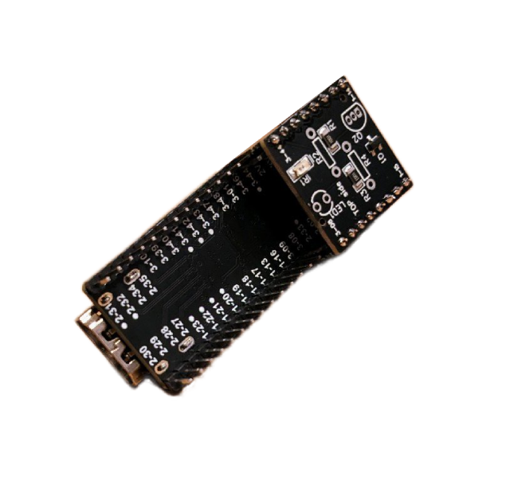
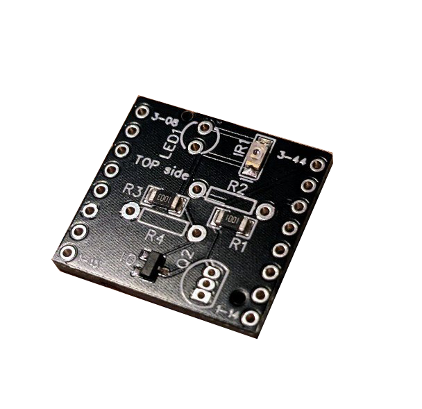

# Mini-Shield for the Time Sleuth project on Tang Nano 4k
This small board is a shield which can be used on the Tang Nano 4k FPGA board.
It contains the circuit required for the [Time Sleuth project](https://github.com/chriz2600/time-sleuth) by [chriz2600](https://github.com/chriz2600), [ported to the Tang Nano 4k](https://github.com/pthalin/video_lag_tester) by [Patrik's Retro Tech](https://github.com/pthalin).
It can be populated either using through-hole components or SMD components.

*Do not place the same component as SMD and through-hole.*

## Usage
Just place the shield on the bottom-side of the Tang Nano 4k board with the component-side looking away from the board.
The shield PCB has the pin names at the 4 corners printed on, to which it should connect to on the Tang Nano 4k board (the pin names are also printed on the bottom side of the Tang Nano 4k).
You can also see an image in this repo.

## Parts
The board can be either populated using THT or SMD components.
Do not populate both, just either or.
When ordering pre-assembled, the SMD version should be always cheaper.

The SMD version includes the components *IR1, R1, Q1 and R3*.
If you order pre-assembled, only tick these components.

The THT components are *LED1, R2, Q2 and R4*.
### SMD
| **Reference** | **Value**| **Links**
|---------------|----------|----------|
|IR1 | Phototransistor 1206 | [LCSC](https://www.lcsc.com/product-detail/Phototransistors_Everlight-Elec-PT11-21C-L41-TR8_C16746.html)|
|R1 | 1k 1206 Resistor | [LCSC](https://www.lcsc.com/product-detail/Chip-Resistor-Surface-Mount_UNI-ROYAL-Uniroyal-Elec-1206W4F1001T5E_C4410.html)|
|Q1 | 2N7002 NMOS-FET SOT-23 | [LCSC](https://www.lcsc.com/product-detail/MOSFETs_Jiangsu-Changjing-Electronics-Technology-Co-Ltd-2N7002_C8545.html)|
|R3 | 100k 1206 Resistor | [LCSC](https://www.lcsc.com/product-detail/Chip-Resistor-Surface-Mount_UNI-ROYAL-Uniroyal-Elec-1206W4F1003T5E_C17900.html)|

### Through-hole
| **Reference** | **Value**| **Links**
|---------------|----------|----------|
|LED1 | Phototransistor with clear case, e.g. PT331C | |
|R2 | 1k Resistor | |
|Q2 | 2N7000 NMOS-FET | |
|R4 | 100k Resistor | |

## Images

